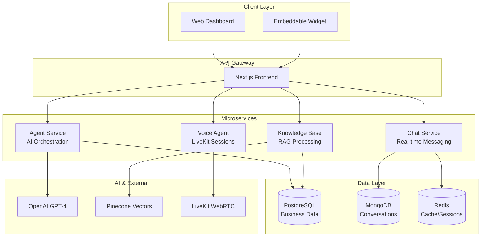

# 🤖 Syntera

**Multi-tenant conversational AI platform for customer service automation**

Syntera is a portfolio project demonstrating production-quality implementation of a multi-tenant SaaS platform for AI-powered customer service. It handles real-time conversations across multiple channels (chat, voice, email) with context-aware responses, workflow automation, and analytics.

**Portfolio Focus**: This project showcases scalable architecture, real-time communication patterns, RAG implementations, and enterprise-grade security practices.

**Key Features:**

- **Multi-channel AI conversations** with intelligent routing
- **Enterprise knowledge bases** with RAG for accurate responses
- **Workflow automation** with custom triggers and actions
- **Real-time analytics** and performance monitoring
- **Multi-tenant architecture** with data isolation

## ⚡ Core Features

| Category          | Capabilities                                                           |
| ----------------- | ---------------------------------------------------------------------- |
| **Conversations** | Multi-channel (chat, voice, email), context-aware, intelligent routing |
| **AI Engine**     | GPT-4 with custom prompts, RAG knowledge bases, workflow automation    |
| **Enterprise**    | Multi-tenant SaaS, row-level security, production monitoring           |
| **Business**      | CRM integration, analytics dashboard, API-first design                 |

## 🏗️ Architecture Overview



## 🎯 Technical Implementation

### Key Decisions

- **TypeScript**: Type safety across the entire stack
- **Microservices**: Independent scaling for different workloads
- **Dual Database**: PostgreSQL for business data, MongoDB for conversations
- **LiveKit**: WebRTC for low-latency voice interactions
- **Pinecone**: Vector search for RAG knowledge retrieval

### Technical Features

- **Multi-tenancy**: Row-level security with company isolation
- **Error Handling**: Sentry monitoring across all services
- **Security**: JWT auth, rate limiting, input validation
- **Scalability**: Horizontal scaling with Railway infrastructure

## 🚀 Quick Start

```bash
git clone https://github.com/harshmriduhash/syntera.git
cd syntera

# Configure environment variables
# Create .env.local with required API keys (see docs/DEPLOYMENT.md)
# Required: Supabase, OpenAI, LiveKit, Pinecone

# Install dependencies and run all services
pnpm install
pnpm run dev:all
```

## 📊 Live Demo

**Try the platform**:

- Interactive chat with AI agents
- Voice conversations with LiveKit
- Real-time response generation
- Multi-language support

## 📚 Documentation

| Document                                | Purpose                          |
| --------------------------------------- | -------------------------------- |
| [📖 Architecture](docs/ARCHITECTURE.md) | System design and data flow      |
| [🔒 Security](docs/SECURITY.md)         | Security measures and compliance |
| [🚀 Deployment](docs/DEPLOYMENT.md)     | Production setup guide           |
| [🔧 API Reference](docs/API.md)         | Complete API documentation       |
| [⚙️ Workflows](docs/WORKFLOWS.md)       | Automation and triggers          |

## 💰 Potential Business Impact

- **Cost Reduction**: Automated routing can reduce support tickets by 60-80%
- **Revenue Growth**: AI-driven lead qualification and sales automation
- **Scale**: Designed to handle thousands of concurrent conversations
- **Quality**: 24/7 consistent, accurate responses

## 🛠️ Technology Stack

| Layer              | Technologies                                  |
| ------------------ | --------------------------------------------- |
| **Frontend**       | Next.js 16, React 18, Tailwind CSS, Shadcn/ui |
| **Backend**        | Node.js, Express, TypeScript, Socket.io       |
| **AI**             | OpenAI GPT-4, Pinecone, LiveKit Agents        |
| **Database**       | PostgreSQL, MongoDB, Redis                    |
| **Infrastructure** | Railway, Vercel, Docker                       |

## 📄 License

Licensed under MIT License

---

**Production-quality conversational AI platform demonstrating scalable architecture and enterprise patterns.**
