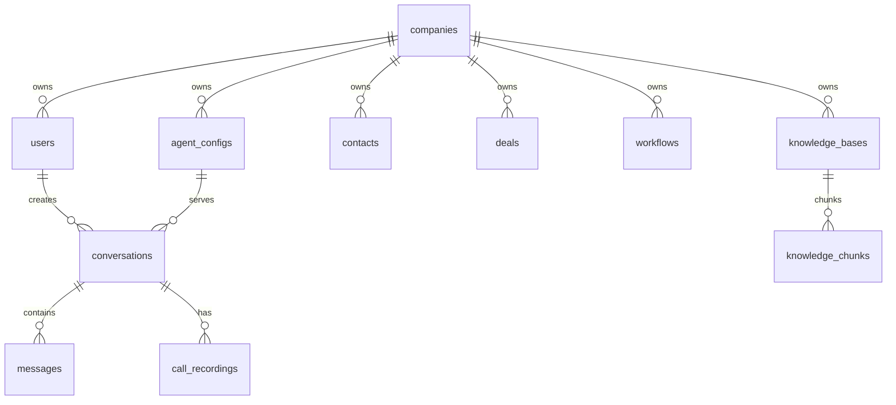

# Database Schema

**PostgreSQL migrations and schema definitions.**

## Database Overview



## Migration History

| Migration | Purpose |
|-----------|---------|
| 001 | Initial schema (companies, users, agent_configs) |
| 002 | Row Level Security policies |
| 003 | Knowledge base tables |
| 004 | Call recordings and storage |
| 005 | Storage bucket configuration |
| 006 | Knowledge base performance indexes |
| 007 | Recordings storage bucket |
| 008 | Clear call recordings data |
| 009 | Public API key support |
| 010 | Workflow automation tables |
| 011 | Notification system |
| 012 | Agent avatar URL field |

## Key Tables

### Core Business Tables
- **companies**: Multi-tenant organization data
- **users**: User accounts with company association
- **agent_configs**: AI agent configurations
- **contacts**: CRM contact management
- **deals**: Sales pipeline tracking

### Conversation Tables
- **conversations**: Chat sessions and metadata
- **messages**: Individual chat messages
- **call_recordings**: Voice call storage

### Automation Tables
- **workflows**: Visual workflow definitions
- **workflow_executions**: Workflow run history
- **notifications**: User notification preferences

### Knowledge Tables
- **knowledge_bases**: Document collections
- **knowledge_chunks**: Vectorized document chunks

## Security Model

- **Row Level Security (RLS)** enabled on all tables
- **Company-scoped access** for all business data
- **JWT authentication** with role-based permissions
- **API key authentication** for external integrations

## Migration Commands

```bash
# Run migrations
pnpm run db:migrate

# Create new migration
# Edit SQL file in migrations/ directory
# Commit and deploy
```

## Data Relationships

- **Companies** own all business data
- **Users** can only access their company's data
- **Agents** are company-scoped configurations
- **Conversations** link users, agents, and messages
- **Workflows** trigger on conversation events
