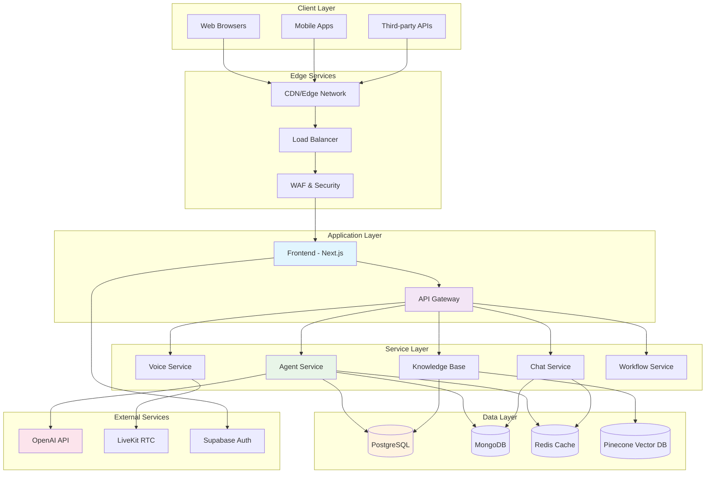
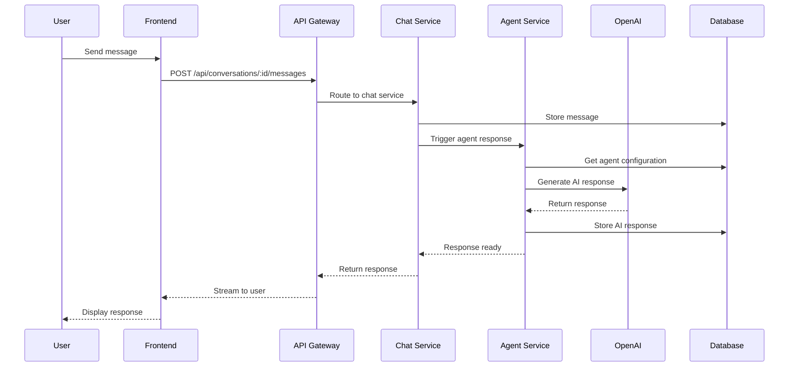
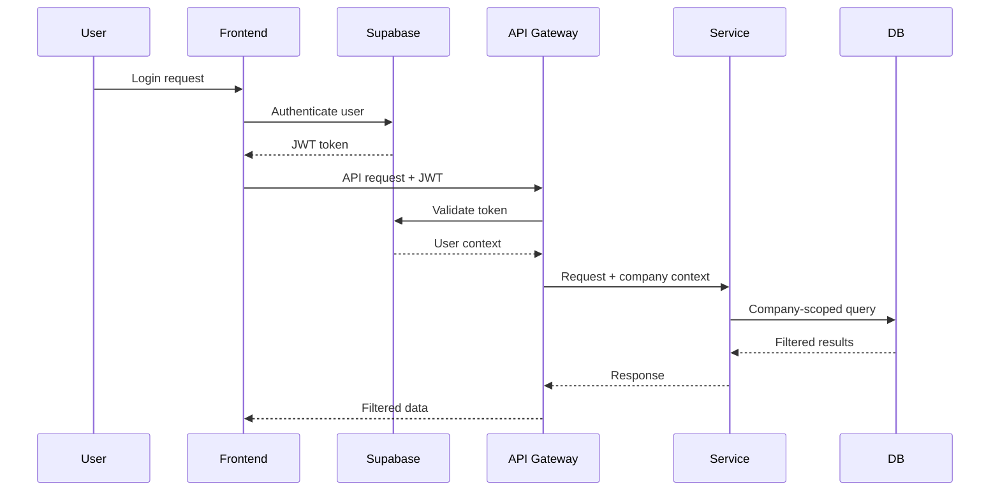
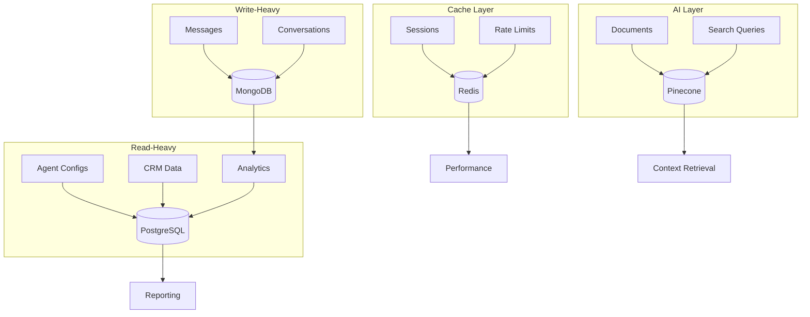
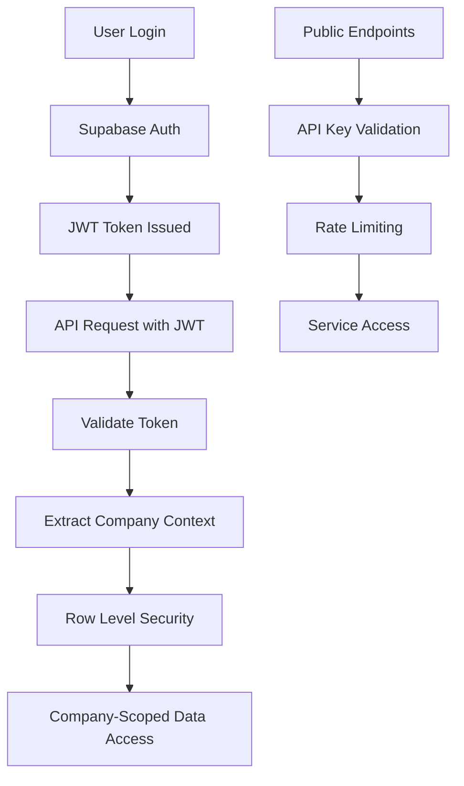
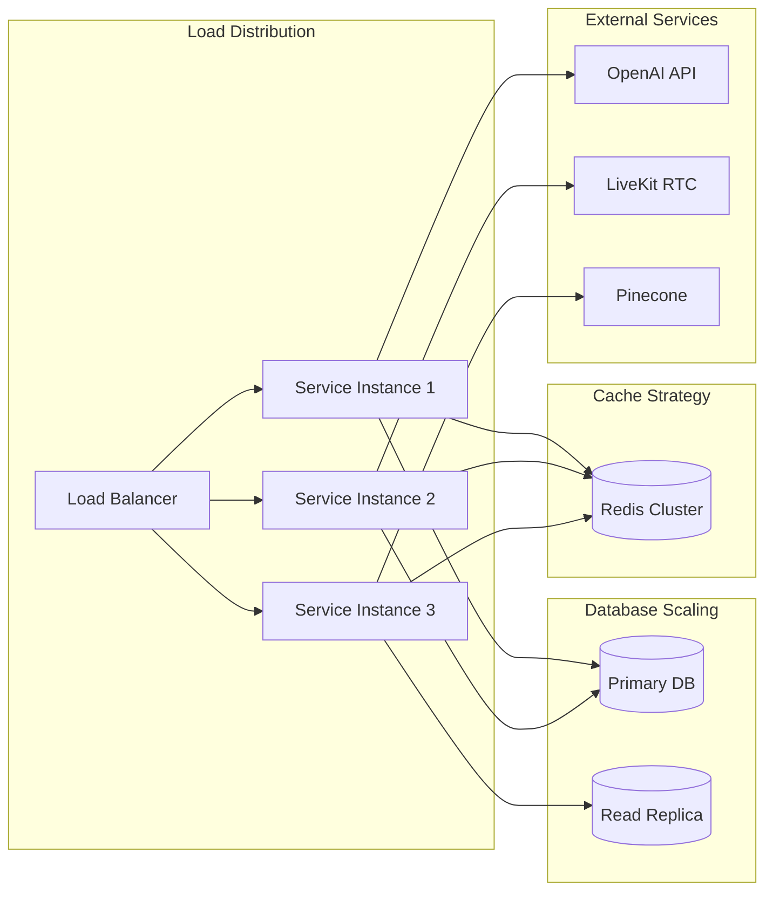
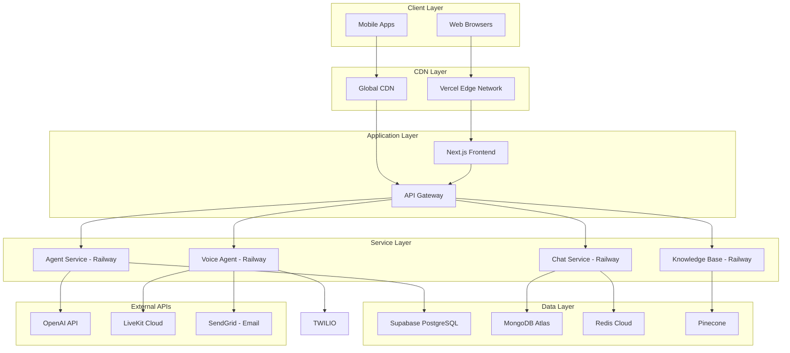
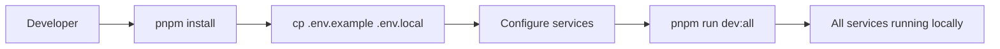
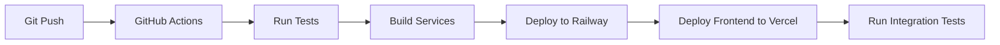

# Syntera Architecture Guide

**Technical Architecture and System Design**

This document outlines the system architecture, design decisions, and technical implementation of the Syntera conversational AI platform.

---

## 🏗️ System Overview

Syntera is a multi-tenant SaaS platform that enables enterprises to deploy AI-powered customer service agents. The system handles real-time conversations across multiple channels with robust security measures.

### Core Capabilities
- **Multi-channel AI conversations** (chat, voice)
- **Intelligent agent orchestration** with workflow automation
- **Knowledge bases** with RAG capabilities
- **Real-time analytics** and performance monitoring
- **CRM integration** for customer data management

---

## 🏛️ High-Level Architecture



**Key Design Principles:**
- **Microservices architecture** for scalability and maintainability
- **Event-driven communication** between services
- **Multi-tenant data isolation** at all layers
- **Real-time capabilities** for live interactions
- **Security** with comprehensive access controls

---

## 🔄 Data Flow Architecture

### Conversation Flow


### Authentication Flow


---

## 🗂️ Component Architecture

### Frontend Architecture (Next.js)

```
frontend/
├── app/                    # Next.js 13+ app router
│   ├── api/               # API routes (server-side)
│   ├── dashboard/         # Main application pages
│   ├── auth/             # Authentication flows
│   └── page.tsx          # Landing page
├── components/            # Reusable UI components
│   ├── ui/               # Base UI library
│   ├── dashboard/        # Dashboard components
│   ├── chat/            # Chat interface
│   └── workflows/       # Workflow builder
├── lib/                  # Utilities and configurations
│   ├── api/             # API client functions
│   ├── supabase/        # Database client
│   └── livekit/         # Real-time client
└── hooks/                # Custom React hooks
```

**Key Patterns:**
- **Server Components** for data fetching
- **Client Components** for interactivity
- **API Routes** as backend-for-frontend
- **Optimistic Updates** for real-time UX

### Backend Services Architecture

#### Agent Service (Node.js/TypeScript)
```
services/agent/
├── src/
│   ├── routes/           # API endpoints
│   │   ├── agents.ts    # Agent CRUD
│   │   ├── responses.ts # AI generation
│   │   └── workflows.ts # Workflow execution
│   ├── services/        # Business logic
│   │   ├── openai.ts    # AI integration
│   │   └── livekit.ts   # Real-time setup
│   └── middleware/      # Auth & validation
└── config/
    └── database.ts      # Supabase client
```

#### Chat Service (Node.js/TypeScript)
```
services/chat/
├── src/
│   ├── handlers/        # Socket.io handlers
│   ├── routes/          # REST endpoints
│   └── models/          # MongoDB schemas
└── utils/
    └── cache.ts         # Redis operations
```

#### Knowledge Base Service (Node.js/TypeScript)
```
services/knowledge-base/
├── src/
│   ├── services/        # Core logic
│   │   ├── embeddings.ts # Text processing
│   │   ├── pinecone.ts   # Vector operations
│   │   └── chunker.ts    # Document splitting
│   └── routes/          # API endpoints
└── files/               # Document storage
```

#### Voice Agent Service (Python)
```
services/voice-agent/
├── src/
│   ├── agent.py         # LiveKit agent logic
│   ├── config.py        # Service configuration
│   ├── contact_extractor.py # CRM integration
│   └── knowledge_base.py # RAG queries
└── utils/
    └── logger.py        # Structured logging
```

---

## 💾 Data Architecture

### Database Strategy

**PostgreSQL (Supabase)** - Business Data
- **Agent configurations** (company-scoped)
- **CRM data** (contacts, deals)
- **User management** (multi-tenant users)
- **Workflow definitions**
- **Analytics metadata**

**Why PostgreSQL:**
- ACID transactions for business data
- Advanced querying for analytics
- Row Level Security for multi-tenancy
- JSONB for flexible metadata

**MongoDB** - Conversation Data
- **Message history** (high-volume writes)
- **Conversation threads** (flexible schemas)
- **Real-time chat data**

**Why MongoDB:**
- High write throughput for messages
- Flexible document schemas
- Horizontal scaling for chat data
- Fast queries for conversation history

**Redis** - Caching & Sessions
- **Session management**
- **Rate limiting data**
- **Temporary caches**
- **Real-time pub/sub**

**Pinecone** - Vector Search
- **Document embeddings**
- **Semantic search**
- **RAG context retrieval**

### Data Flow Patterns



---

## 🔒 Security Architecture

### Authentication & Authorization



**Security Layers:**
1. **Supabase Authentication** - JWT-based auth
2. **Row Level Security** - Database-level isolation
3. **API Key Authentication** - External integrations
4. **Rate Limiting** - DDoS protection
5. **Input Validation** - Zod schemas throughout
6. **Audit Logging** - Compliance tracking

### Multi-Tenant Isolation

**Database Level:**
- All tables include `company_id` foreign keys
- RLS policies enforce company data access
- No cross-company data leakage

**Application Level:**
- JWT tokens include company context
- All queries filtered by company scope
- Service-level validation of company access

---

## 📊 Scalability Design

### Horizontal Scaling Strategy



### Performance Optimizations

**Database Optimization:**
- Strategic indexing on frequently queried fields
- Connection pooling for database connections
- Read replicas for analytics queries
- Query optimization and prepared statements

**Caching Strategy:**
- Redis for session data and temporary caches
- Application-level caching for expensive operations
- CDN for static assets and API responses

**Real-Time Optimization:**
- WebSocket connection pooling
- Message queuing for high-throughput scenarios
- Load balancing across LiveKit servers

---

## 🚀 Deployment Architecture

### Production Infrastructure



### Service Deployment Strategy

**Frontend:** Vercel (global edge network, automatic scaling)
**Services:** Railway (managed containers, auto-scaling)
**Databases:** Managed cloud services (Supabase, MongoDB Atlas)
**External APIs:** Cloud services (OpenAI, LiveKit, etc.)

---

## 🔧 Technology Choices & Rationale

### Frontend Framework
**Next.js 16 with App Router**
- **Why:** Server components for performance, App Router for better UX
- **Benefits:** SEO optimization, fast loading, modern React patterns

### Backend Runtime
**Node.js with TypeScript**
- **Why:** JavaScript ecosystem consistency, strong typing
- **Benefits:** Developer productivity, type safety, rich ecosystem

### Voice Agent Runtime
**Python with LiveKit**
- **Why:** LiveKit's Python SDK is most mature, asyncio for real-time
- **Benefits:** Better voice processing, async performance

### Database Choices
**PostgreSQL + MongoDB + Redis**
- **Why:** Right tool for each workload type
- **Benefits:** Performance optimization, cost efficiency

### Real-Time Infrastructure
**LiveKit + Socket.io**
- **Why:** LiveKit for WebRTC, Socket.io for messaging
- **Benefits:** Production-ready, scalable architecture

### AI Integration
**OpenAI GPT-4 + Pinecone**
- **Why:** Industry standard for quality and RAG capabilities
- **Benefits:** Production reliability, advanced features

---

## 📈 Monitoring & Observability

### Application Monitoring
- **Error Tracking:** Sentry for all services
- **Performance Monitoring:** Custom metrics collection
- **API Monitoring:** Response times, error rates, throughput

### Infrastructure Monitoring
- **Service Health:** Railway deployment monitoring
- **Database Performance:** Query performance tracking
- **External API Usage:** Rate limiting and quota monitoring

### Business Metrics
- **User Engagement:** Conversation metrics, response times
- **System Performance:** Uptime, latency, error rates
- **AI Performance:** Token usage, response quality metrics

---

## 🔄 Development Workflow

### Local Development


### CI/CD Pipeline


### Environment Management
- **Local:** All services run via Docker Compose
- **Development:** Shared development environment
- **Staging:** Production-like environment for testing
- **Production:** Fully managed cloud infrastructure

---

This architecture enables Syntera to deliver scalable conversational AI while maintaining flexibility to scale and evolve.
