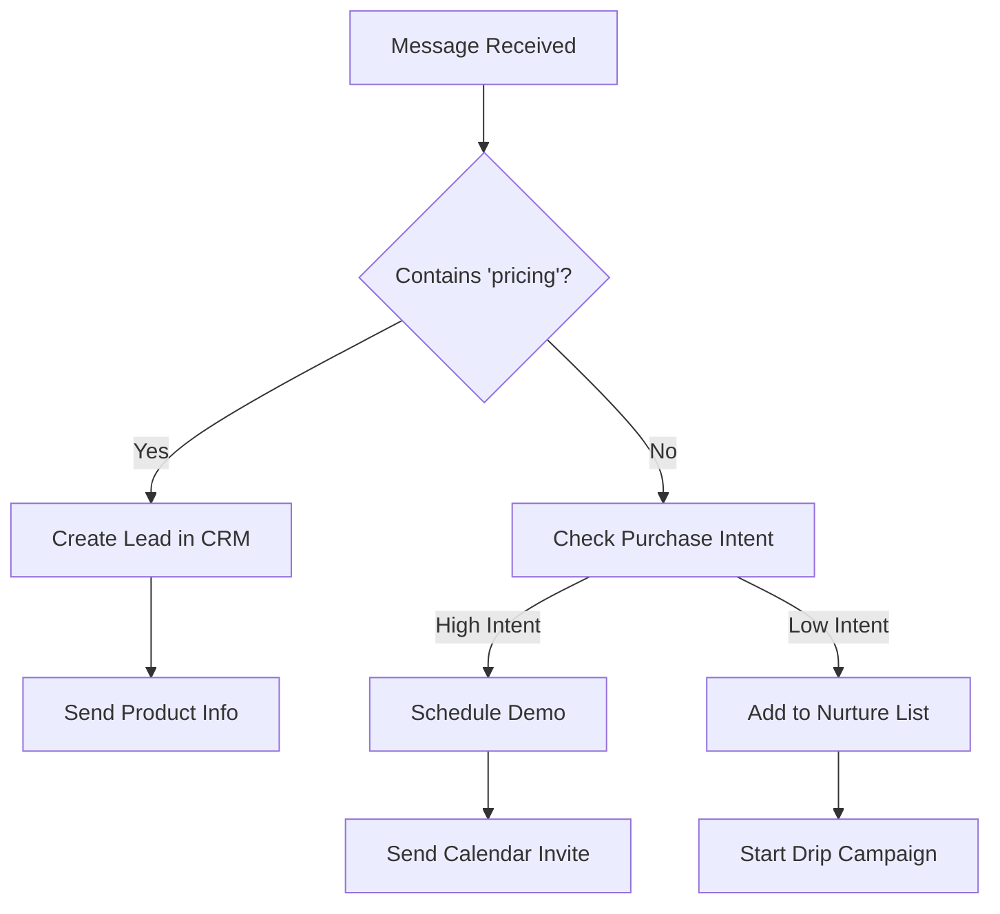
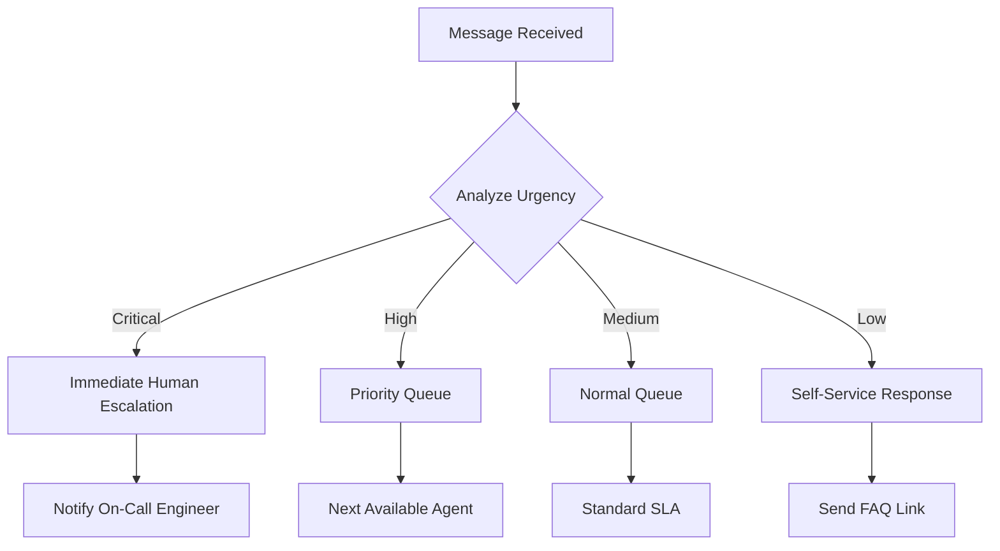
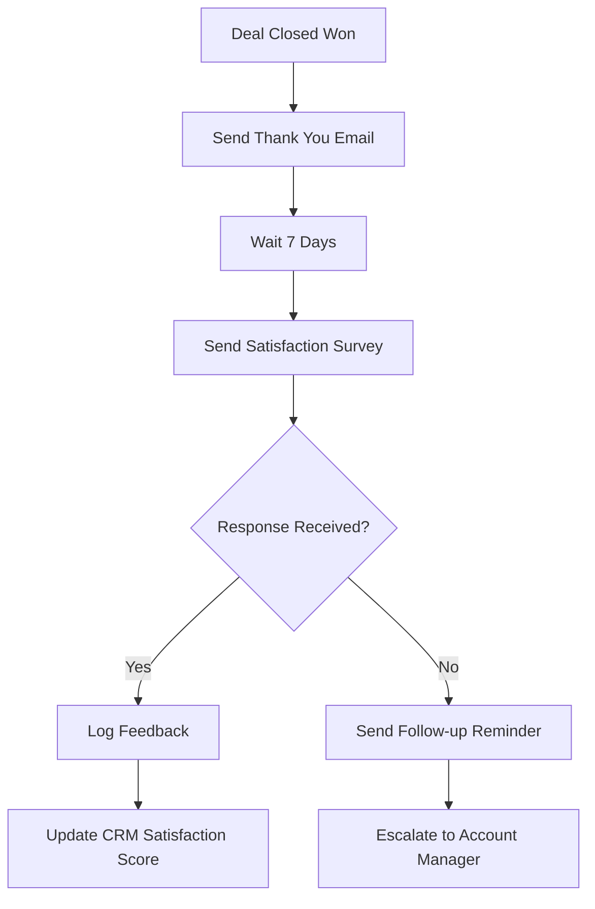

# Syntera Workflow Guide

**Visual automation for customer service processes**

Workflows enable automation of complex customer interactions without custom development. Build visual automation flows using drag-and-drop nodes and conditional logic.

---

## 🎯 Workflow Types

### Customer Onboarding Automation
```
Lead Captures Email → Qualify Lead → Create Contact → Send Welcome Email → Schedule Follow-up
```

**Use Case:** Automatically nurture new leads captured through website chat.

### Support Ticket Escalation
```
Urgent Keywords Detected → Check Agent Availability → Escalate to Human → Notify Manager → Update CRM
```

**Use Case:** Ensure critical customer issues get immediate human attention.

### Sales Qualification Flow
```
Purchase Intent Detected → Check Customer History → Generate Quote → Send Proposal → Schedule Demo
```

**Use Case:** Convert interested prospects into qualified sales opportunities.

### Multi-Channel Response Coordination
```
Customer Messages on Multiple Channels → Consolidate Context → Single Agent Response → Sync All Channels
```

**Use Case:** Maintain consistent responses across email, chat, and social media.

---

## 🔧 Available Triggers

### Conversation Events
- `conversation_started` - New conversation begins
- `conversation_ended` - Conversation completes
- `message_received` - New message arrives
- `agent_assigned` - Agent takes conversation

### CRM Events
- `contact_created` - New contact added
- `contact_updated` - Contact information changes
- `deal_created` - New sales opportunity
- `deal_stage_changed` - Deal moves through pipeline

### Time-Based Triggers
- `scheduled_time` - Execute at specific time
- `conversation_idle` - No activity for X minutes
- `follow_up_due` - Customer follow-up needed

### External Triggers
- `webhook` - External system integration
- `api_call` - REST API trigger
- `email_received` - New email arrives

---

## 🏗️ Node Types

### Action Nodes

**Send Email**
```json
{
  "type": "send_email",
  "config": {
    "to": "{{contact.email}}",
    "subject": "Welcome to {{company.name}}",
    "template": "welcome_email",
    "variables": {
      "customer_name": "{{contact.first_name}}",
      "company_name": "{{company.name}}"
    }
  }
}
```

**Create CRM Deal**
```json
{
  "type": "create_deal",
  "config": {
    "title": "New Lead from {{channel}}",
    "value": 5000,
    "stage": "qualified",
    "contact_id": "{{conversation.contact_id}}",
    "probability": 75
  }
}
```

**HTTP Request**
```json
{
  "type": "http_request",
  "config": {
    "method": "POST",
    "url": "https://api.company.com/webhook",
    "headers": {
      "Authorization": "Bearer {{api_key}}",
      "Content-Type": "application/json"
    },
    "body": {
      "event": "new_lead",
      "contact": "{{contact}}",
      "conversation": "{{conversation}}"
    }
  }
}
```

### Logic Nodes

**Condition Branch**
```json
{
  "type": "condition",
  "config": {
    "condition": "{{message.content}} contains 'urgent'",
    "true_path": "escalate",
    "false_path": "normal_handling"
  }
}
```

**Wait/Delay**
```json
{
  "type": "delay",
  "config": {
    "duration": "2 hours",
    "condition": "no_response"
  }
}
```

**Loop Iterator**
```json
{
  "type": "loop",
  "config": {
    "items": "{{unread_emails}}",
    "iterator": "email",
    "max_iterations": 10
  }
}
```

---

## 📊 Workflow Examples

### Example 1: Lead Nurturing Automation



**Configuration:**
- **Trigger:** `message_received`
- **Condition:** Message analysis for purchase intent
- **Actions:** CRM updates, email sequences, calendar booking

### Example 2: Support Escalation Matrix



**Configuration:**
- **Trigger:** `message_received`
- **AI Analysis:** Sentiment + keyword detection
- **Escalation Rules:** Priority-based routing

### Example 3: Post-Sale Follow-Up



**Configuration:**
- **Trigger:** `deal_stage_changed` to "closed-won"
- **Timing:** Automated follow-up sequences
- **CRM Integration:** Update satisfaction metrics

---

## 🔄 Variable System

### Built-in Variables

**Conversation Data:**
- `{{conversation.id}}` - Conversation identifier
- `{{conversation.channel}}` - chat, voice, email
- `{{conversation.started_at}}` - Start timestamp
- `{{message.content}}` - Latest message text
- `{{message.sender_type}}` - user, agent, system

**Contact Data:**
- `{{contact.first_name}}` - Customer first name
- `{{contact.last_name}}` - Customer last name
- `{{contact.email}}` - Customer email
- `{{contact.company_name}}` - Organization name

**Agent Data:**
- `{{agent.name}}` - Assigned agent name
- `{{agent.id}}` - Agent identifier

**CRM Data:**
- `{{deal.value}}` - Deal monetary value
- `{{deal.stage}}` - Current pipeline stage
- `{{deal.probability}}` - Close probability percentage

### Custom Variables

**Store and reuse data:**
```json
{
  "type": "set_variable",
  "config": {
    "name": "customer_priority",
    "value": "{{analysis.priority_score}}"
  }
}
```

**Use in subsequent nodes:**
```json
{
  "type": "condition",
  "config": {
    "condition": "{{customer_priority}} > 8",
    "true_path": "vip_handling"
  }
}
```

---

## 📈 Analytics & Monitoring

### Workflow Performance Metrics

**Execution Tracking:**
- Success/failure rates per workflow
- Average execution time
- Bottleneck identification

**Business Impact:**
- Conversion rates from automated workflows
- Customer satisfaction improvements
- Cost savings from automation

### Monitoring Dashboard

**Real-time Metrics:**
- Active workflow executions
- Queue depths by priority
- Error rates and failure patterns
- SLA compliance tracking

**Historical Analytics:**
- Workflow performance trends
- Most effective automation patterns
- ROI calculations per workflow

---

## 🚀 Best Practices

### Design Principles

**Start Simple:** Begin with single-trigger, single-action workflows.

**Test Thoroughly:** Use workflow testing before production deployment.

**Monitor Performance:** Track execution metrics and iterate on bottlenecks.

**Document Logic:** Maintain clear documentation of complex workflow logic.

### Common Patterns

**Lead Qualification:**
```
Message → Intent Analysis → CRM Update → Automated Response → Human Handoff
```

**Support Routing:**
```
Issue → Categorization → Priority Assignment → Queue Selection → Agent Assignment
```

**Follow-up Sequences:**
```
Event → Delay → Condition Check → Action → Next Step
```

### Error Handling

**Fallback Actions:**
- Default responses for failed external API calls
- Alternative routing when primary agents unavailable
- Graceful degradation for system outages

**Retry Logic:**
- Configurable retry attempts for transient failures
- Exponential backoff for external service calls
- Dead letter queues for persistent failures

---

## 🔧 API Integration

### Workflow Management

**List Workflows:**
```http
GET /api/workflows
```

**Create Workflow:**
```http
POST /api/workflows
Content-Type: application/json

{
  "name": "Lead Nurturing",
  "description": "Automate new lead engagement",
  "trigger_type": "message_received",
  "trigger_config": {
    "keywords": ["pricing", "demo", "quote"]
  },
  "nodes": [...],
  "edges": [...]
}
```

**Test Workflow:**
```http
POST /api/workflows/:id/test
```

**Execution History:**
```http
GET /api/workflows/:id/executions
```

### Real-Time Updates

Workflow executions emit real-time events:
```javascript
socket.on('workflow:execution', (data) => {
  console.log('Workflow executed:', data.workflow_id);
});
```

---

## 🎯 Use Cases by Industry

### E-commerce
- Abandoned cart recovery
- Order status updates
- Customer feedback collection
- Upsell recommendations

### SaaS Companies
- Trial conversion automation
- Feature adoption tracking
- Customer success check-ins
- Churn prevention alerts

### Financial Services
- Account opening assistance
- Transaction notifications
- Fraud alert automation
- Compliance document requests

### Healthcare
- Appointment scheduling
- Prescription refill reminders
- Patient intake automation
- Follow-up care coordination

---

Workflows automate customer service processes to improve response times and operational efficiency.
