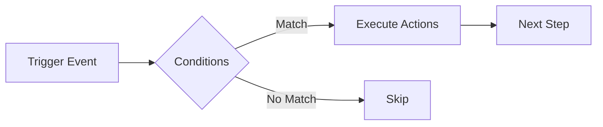

# Syntera Frontend

**Next.js 16 application with App Router architecture.**

## Application Structure

```
frontend/
├── app/                    # App Router pages
│   ├── api/               # API routes (proxy to services)
│   ├── dashboard/         # Protected dashboard pages
│   │   ├── agents/        # Agent management
│   │   ├── analytics/     # Analytics dashboard
│   │   ├── crm/          # Contacts & deals
│   │   └── workflows/     # Workflow builder
│   ├── auth/              # Authentication pages
│   └── page.tsx           # Landing page
├── components/            # Reusable UI components
│   ├── ui/               # Shadcn/ui primitives
│   ├── chat/             # Chat interface components
│   ├── voice-call/       # LiveKit voice components
│   ├── workflows/        # Workflow builder components
│   └── agents/           # Agent configuration forms
├── lib/                  # Utilities and configurations
│   ├── api/              # API client functions
│   ├── auth/             # Supabase auth utilities
│   ├── livekit/          # WebRTC client setup
│   └── supabase/         # Database client
└── hooks/               # Custom React hooks
```

## Key Features

### 🔐 Authentication
- Supabase Auth integration
- Row-level security
- Multi-tenant user management

### 💬 Real-time Chat
- Socket.io integration
- Message threading
- Agent response coordination
- File attachments support

### 📊 Analytics Dashboard
- Conversation metrics
- Agent performance tracking
- Cost analysis
- CRM insights

### 🎯 Workflow Builder


### 🎤 Voice Integration
- LiveKit WebRTC client
- Real-time voice calls
- Screen sharing capabilities

## Component Architecture

### UI Components (Shadcn/ui)
- **Primitives**: Button, Input, Card, Dialog
- **Composites**: Forms, Tables, Navigation
- **Layouts**: Sidebar, Header, Pagination

### Feature Components
- **Chat**: Message bubbles, typing indicators, thread panels
- **Workflows**: Node-based editor, configuration panels
- **Agents**: Multi-step forms, avatar uploads
- **Analytics**: Charts, metrics cards, date pickers

## API Integration

### Backend Services
```typescript
// API client usage
import { useAgents, useConversations } from '@/lib/api'

// React Query hooks
const { data: agents } = useAgents()
const { mutate: sendMessage } = useSendMessage()
```

### Real-time Updates
```typescript
// Socket.io integration
import { useChatSocketEvents } from '@/hooks/use-chat-socket-events'

const { messages, onMessage } = useChatSocketEvents(conversationId)
```

## Development Commands

```bash
# Install dependencies
pnpm install

# Start development server
pnpm dev

# Build for production
pnpm build

# Type checking
pnpm type-check

# Linting
pnpm lint
```

## Environment Variables

```env
# Supabase
NEXT_PUBLIC_SUPABASE_URL=...
NEXT_PUBLIC_SUPABASE_ANON_KEY=...

# Service URLs
NEXT_PUBLIC_CHAT_SERVICE_URL=...
NEXT_PUBLIC_AGENT_SERVICE_URL=...

# LiveKit
NEXT_PUBLIC_LIVEKIT_URL=...
```

## Performance Optimizations

- **Server Components**: App Router with server/client boundaries
- **React Query**: Intelligent caching and background updates
- **Image Optimization**: Next.js automatic optimization
- **Code Splitting**: Route-based and component-based splitting
