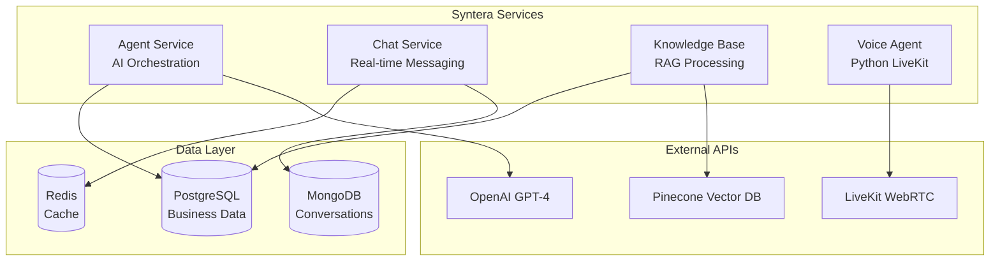

# Syntera Microservices

**4 specialized services handling conversational AI workloads.**

## Architecture Overview



## Service Responsibilities

### 🤖 Agent Service (Port 4002)
**AI orchestration and workflow execution.**
- OpenAI GPT-4 integration with custom prompts
- Workflow automation with custom triggers
- Agent configuration and management
- Response generation and optimization

### 💬 Chat Service (Port 4004)
**Real-time messaging and conversation management.**
- Socket.io for live chat connections
- Message threading and history
- Conversation state management
- Agent response coordination

### 📚 Knowledge Base Service (Port 4005)
**Document processing and retrieval-augmented generation.**
- PDF/text document chunking
- Pinecone vector embeddings
- Semantic search capabilities
- Document lifecycle management

### 🎤 Voice Agent Service (Port 4008)
**Python-based voice AI with LiveKit WebRTC.**
- LiveKit session management
- Multi-language speech processing
- Real-time voice interactions
- CRM data extraction from conversations

## Development Commands

```bash
# Start all services
pnpm run dev:all

# Individual services
cd services/agent && pnpm dev
cd services/chat && pnpm dev
cd services/knowledge-base && pnpm dev
cd services/voice-agent && python src/main.py --mode both
```

## API Endpoints

| Service | Base URL | Primary Functions |
|---------|----------|-------------------|
| Agent | `/api/agents` | Agent CRUD, AI responses |
| Chat | `/api/conversations` | Messages, real-time chat |
| Knowledge Base | `/api/knowledge-base` | Document upload, search |
| Voice Agent | WebSocket | LiveKit voice sessions |

## Service Communication

- **HTTP APIs** for service-to-service calls
- **WebSockets** for real-time features
- **Shared MongoDB** for conversation data
- **Shared Redis** for caching and sessions
- **Railway** for deployment and scaling
